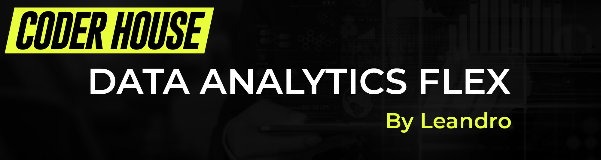

# Curso de Data Analytics Flex - CODER HOUSE

Bienvenido al repositorio del curso de Data Analytics Flex de CODER HOUSE. Este repositorio contiene todos los materiales de apoyo, como presentaciones y documentos de práctica, necesarios para el curso.

## Estructura del Repositorio
Este repositorio está organizado por carpetas que corresponden a las distintas unidades y temas tratados en el curso. Cada carpeta contiene los materiales pertinentes como presentaciones en PowerPoint y documentos de actividades.

### Unidades del Curso

| # | Clase | PPT | Vídeo | 
|---|-----------|------------|-------|
|01|[Onboarding y Nivelación](https://github.com/dawoork/Clases/tree/main/01.%20Onboarding%20y%20Nivelacion)|[📝](https://docs.google.com/presentation/d/1vVR9EUBs1PH2_s8HQ6IAIv0LXppqXuym/edit?usp=drive_link&ouid=114807045256561798882&rtpof=true&sd=true)|proximamente...|
|02|[Introducción a Data Analytics](https://github.com/dawoork/Clases/tree/main/02.%20Introducci%C3%B3n%20a%20Data%20Analytics)|[📝](https://docs.google.com/presentation/d/1p_jjGJIxEh2FL-yAsrziH_FlmHybcrnC/edit?usp=drive_link&ouid=114807045256561798882&rtpof=true&sd=true)|proximamente...|
|03|[Base de datos y modelo relacional](https://github.com/dawoork/Clases/tree/main/03.%20Base%20de%20datos%20y%20modelo%20relacional)|[📝](https://docs.google.com/presentation/d/19PAXnxiz7ZLgt_1s0y4G7GA0Vw3dT89-/edit?usp=drive_link&ouid=114807045256561798882&rtpof=true&sd=true)|proximamente...|
|04|[Lenguaje SQL Sublenguajes DDL y DML](https://github.com/dawoork/Clases/tree/main/04.%20Lenguaje%20SQL%20Sublenguajes%20DDL%20y%20DML)|[📝](https://docs.google.com/presentation/d/16FnlmxRiRR88p1FciP9vdc6MOZEdb154/edit?usp=drive_link&ouid=114807045256561798882&rtpof=true&sd=true)|proximamente...|
|05|[Lenguaje SQL, funciones escalares y subconsultas](https://github.com/dawoork/Clases/tree/main/05.%20Lenguaje%20SQL%2C%20funciones%20escalares%20y%20subconsultas)|[📝](https://docs.google.com/presentation/d/1W4dhvCvy9ekucJdbU1QIlzsUpfz1yzni/edit?usp=drive_link&ouid=114807045256561798882&rtpof=true&sd=true)|proximamente...|
|06|[Sentencias JOIN y UNION](https://github.com/dawoork/Clases/tree/main/06.%20Lenguaje%20%20SQL%2C%20Sentencias%20JOIN%20y%20UNION)|[📝](https://docs.google.com/presentation/d/1M0XDwBkn6ONKCbzTONet7eND-N3XJr4p/edit?usp=drive_link&ouid=114807045256561798882&rtpof=true&sd=true)|proximamente...|
|07|[Historia con Datos](https://github.com/dawoork/Clases_DA/tree/main/07.%20Historia%20con%20Datos)|[📝](https://docs.google.com/presentation/d/1ZvmOxDrwhztN2bXArqdNAmS1jjq4JJBu/edit?usp=drive_link&ouid=114807045256561798882&rtpof=true&sd=true)|proximamente...|
|08|[Introducción a Power BI](https://github.com/dawoork/Clases/tree/main/08.%20Introducci%C3%B3n%20a%20Power%20BI)|[📝](https://docs.google.com/presentation/d/1mxlsX-7dzNlYUmglxZagYndBQuQZczV5/edit?usp=drive_link&ouid=114807045256561798882&rtpof=true&sd=true)|proximamente...|
|09|[Práctica con Power BI](https://github.com/dawoork/Clases/tree/main/09.%20Pr%C3%A1ctica%20con%20Power%20BI)|[📝](https://docs.google.com/presentation/d/1BfYq2aWrzPgrAGCQfAjgJdi34IWKvOMk/edit?usp=drive_link&ouid=114807045256561798882&rtpof=true&sd=true)|proximamente...|
|10|[Gráficos y segmentaciones. Tips & tricks](https://github.com/dawoork/Clases/tree/main/10.%20Gr%C3%A1ficos%20y%20segmentaciones.%20Tips%20%26%20tricks)|[📝](https://docs.google.com/presentation/d/1jonaWvRUOfWkiVPMlAzK7lzdWgh7xX0f/edit?usp=drive_link&ouid=114807045256561798882&rtpof=true&sd=true)|proximamente...|
|11|[Medidas de tendencia central](https://github.com/dawoork/Clases/tree/main/11.%20Medidas%20de%20tendencia%20central)|[📝](https://docs.google.com/presentation/d/1pQLKg54Lb-oGCyvvgiW7McGVimmq4_KG/edit?usp=drive_link&ouid=114807045256561798882&rtpof=true&sd=true)|proximamente...|

---
---

## Instrucciones para el Uso del Repositorio

Este repositorio contiene todos los materiales del curso de Data Analytics Flex. Aquí encontrarás las instrucciones para acceder y utilizar estos materiales de manera efectiva.

### Acceso a los Materiales

1. **Clona el Repositorio**: Para tener acceso local a todos los materiales, realiza un clon del repositorio usando el siguiente comando en tu terminal:

 ```bash
git clone https://github.com/dawoork/Clases.git
 ```

2. **Navega por las Carpetas**: Cada unidad del curso tiene su propia carpeta dentro del repositorio. Dentro de cada carpeta, encontrarás archivos como presentaciones y documentos de práctica.

### Uso de los Materiales

3. **Consulta las Presentaciones**: Abre las presentaciones para seguir la teoría y los ejemplos que se discuten en las clases.
4. **Realiza las Actividades**: Cada unidad puede incluir documentos de actividades o microdesafíos que debes completar para practicar lo aprendido.

### Colaboración

5. **Reporta Problemas o Sugerencias**: Si encuentras algún error en los materiales o tienes sugerencias para mejorarlos, por favor abre un issue en este repositorio explicando el problema o la sugerencia.
6. **Contribuye con Mejoras**: Si deseas contribuir con correcciones o mejoras a los materiales, puedes hacerlo mediante un pull request. Asegúrate de describir claramente qué cambios has realizado y por qué.

### Mantenimiento del Repositorio

7. **Actualizaciones**: Periodicamente revisaré el repositorio para añadir mejoras y actualizar materiales. Asegúrate de mantener tu copia local sincronizada con el repositorio remoto ejecutando regularmente:

 ```bash
git pull origin main
 ```

### Soporte

8. **Pide Ayuda**: Si tienes dudas sobre los materiales o el curso, puedes contactarme directamente a través de (tu dirección de correo electrónico) o abrir un issue en este repositorio.

## Guía Rápida de Git

Si no estás familiarizado con Git, aquí tienes una guía rápida para empezar:

1. **Fork del Repositorio**: Haz un fork del repositorio para tener una copia en tu cuenta de GitHub, lo cual te permitirá hacer cambios sin afectar el repositorio principal.
2. **Clone Tu Fork**: Clona tu fork a tu máquina local:

 ```bash
git clone https://github.com/dawoork/Clases.git
 ```

3. **Haz tus Cambios**: Realiza cambios o añade nuevos archivos si es necesario.
4. **Commit y Push**: Guarda tus cambios y subelos a tu repositorio:

 ```bash
   git add .
   git commit -m "Descripción de los cambios realizados"
   git push
```

5. **Pull Request**: Si deseas que tus cambios se consideren para ser incluidos en el repositorio principal, envía un pull request desde tu fork en GitHub.

Utiliza estas instrucciones para aprovechar al máximo los materiales del curso y contribuir a la mejora continua del mismo.


*He creado un curso completo gratis para aprender a trabajar con Git y GitHub desde cero.*

[](https://github.com/dawoork/git-hello)

## Te ayudo con tu portafolio 

**Consulta proyectos para que añadas en tu portafolio según tu espacialidad** 

[](https://github.com/dawoork/portafolio-analyst) [](https://github.com/dawoork/portafolio-scientist) 


### Data Scientist

[](https://twitch.tv/leanaraque)
[](https://dawoork.com/discord)
[](https://dawoork.com)

[](https://www.youtube.com/@leanaraque?sub_confirmation=1)
[](https://twitch.com/leanaraque)
[](https://dawoork.com/discord)
[](https://twitter.com/leanaraque)


Soy un Científico de Datos con más de cinco años de experiencia, apasionado por el poder transformador de los datos en empresas de todos los tamaños. redes sociales como **[@leanaraque](https://leanaraque.com)**.

### En mi perfil de GitHub tienes más información

[](https://github.com/leanaraque)
